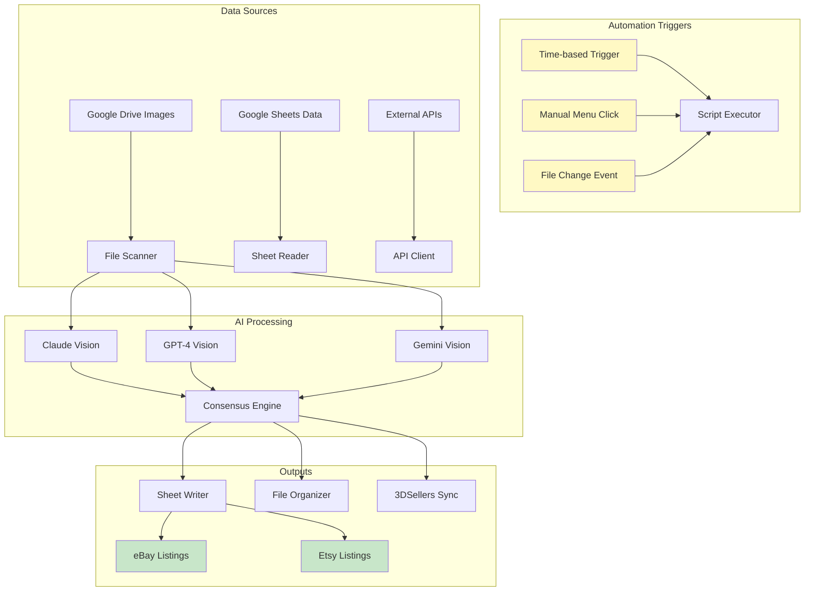

# Google Apps Scripts Collection


A comprehensive library of Google Apps Scripts for e-commerce automation, AI integration, and data processing. These scripts power real production workflows managing thousands of art listings across eBay, Etsy, and other marketplaces.

[](https://asciinema.org/a/cGkClIfGngozepiA)

[](https://asciinema.org/a/cGkClIfGngozepiA)

---

## Architecture



## Table of Contents

1. [Quick Start](#quick-start)
2. [Tier 1: Production-Ready Systems](#tier-1-production-ready-systems)
3. [Tier 2: Specialized Tools](#tier-2-specialized-tools)
4. [Tier 3: Utility Scripts](#tier-3-utility-scripts)
5. [Installation Guide](#installation-guide)
6. [API Key Setup](#api-key-setup)
7. [Common Patterns](#common-patterns)
8. [Troubleshooting](#troubleshooting)

---

## Quick Start

### 1. Copy a Script to Google Sheets

```
1. Open Google Sheets
2. Go to Extensions → Apps Script
3. Delete any existing code
4. Copy/paste the script you want
5. Click Save (💾)
6. Click Run (▶️)
7. Grant permissions when prompted
```

### 2. Set Up API Keys (if needed)

```
1. In Apps Script: File → Project settings → Script properties
2. Click "Add script property"
3. Add your keys:
   - CLAUDE_API_KEY = sk-ant-...
   - OPENAI_API_KEY = sk-...
```

### 3. Create Menu Items

Most scripts automatically add a menu when you refresh the spreadsheet:

```javascript
function onOpen() {
  SpreadsheetApp.getUi()
    .createMenu('🚀 Automation')
    .addItem('Process All', 'processAll')
    .addItem('Settings', 'showSettings')
    .addToUi();
}
```

---

## Tier 1: Production-Ready Systems

### Complete, battle-tested solutions for daily operations

---

### 1. 3DSELLERS_V7_MASTER.gs ⭐⭐⭐

**The flagship script** - Complete inventory management system with AI-powered listing generation.

**What it does:**
- Monitors Google Drive folder for new artwork images
- Uses Claude Vision AI to analyze artwork (artist, title, description)
- Generates SEO-optimized titles and descriptions
- Calculates pricing based on artist/category rules
- Syncs with 3DSellers for eBay/Etsy listing management
- Auto-generates SKUs with smart naming conventions

**Key Features:**
```
✅ AI image analysis (Claude Vision)
✅ Multi-artist pricing rules
✅ Automatic SKU generation
✅ Frame detection (Framed/Unframed)
✅ Batch processing with progress tracking
✅ Error recovery and retry logic
✅ Hourly trigger support
```

**Example: How it processes an image**

```javascript
// When a new image is detected in the INBOUND folder:

1. Script detects new image: "death-nyc-marilyn.jpg"

2. Claude Vision analyzes the image:
   {
     artist: "Death NYC",
     title: "Marilyn Monroe x Chanel No. 5",
     description: "Vibrant pop art piece featuring...",
     framed: false,
     orientation: "portrait"
   }

3. Pricing rules applied:
   - Death NYC unframed = $200 base price

4. SKU generated:
   - Format: {counter}_{artistCode}_{title}
   - Result: "1_DNYC_Marilyn-Monroe-Chanel"

5. Row added to PRODUCTS sheet with all data
```

**Setup:**
1. Create a Google Sheet with a "PRODUCTS" tab
2. Create a "CONFIG" sheet (use CREATE_CONFIG_SHEET.gs)
3. Add your Claude API key to Script Properties
4. Run `createHourlyTrigger()` for automatic monitoring

---

### 2. ROBUST_Dual_AI_Checker_Script.gs ⭐⭐⭐

**Dual-AI verification system** - Uses both Claude AND GPT-4 to verify artwork analysis.

**What it does:**
- First pass: Claude Vision analyzes the artwork
- Second pass: GPT-4 Vision verifies Claude's analysis
- Compares results and flags discrepancies
- Only accepts data when both AIs agree

**Why this matters:**
- Catches AI hallucinations
- Ensures accurate artist identification
- Prevents costly listing errors

**Example: Dual verification in action**

```javascript
// Image: "shepard-fairey-hope.jpg"

// Claude's analysis:
{
  artist: "Shepard Fairey",
  title: "Hope",
  confidence: 0.95
}

// GPT-4's verification:
{
  artist: "Shepard Fairey",
  title: "Hope (Obama)",
  confidence: 0.98,
  agrees_with_claude: true
}

// Result: ✅ Both AIs agree - data accepted
// If they disagreed: ⚠️ Flagged for manual review
```

---

### 3. NEWS_AudienceWeighting.gs ⭐⭐⭐

**AI-powered news curation** - Scores articles by relevance to your target audience.

**What it does:**
- Fetches articles from news sources
- Scores each article on multiple criteria (1-10 scale)
- Weights scores based on audience preferences
- Ranks articles for content curation

**Scoring criteria:**
```
- Relevance to topic: How on-topic is this?
- Timeliness: Is this breaking news or old?
- Credibility: Is the source trustworthy?
- Engagement potential: Will this get shares/clicks?
- Audience fit: Does this match our demographic?
```

**Example output:**

```javascript
// Input: 10 news articles about AI

// Output (ranked by weighted score):
[
  { title: "OpenAI announces GPT-5", score: 92, rank: 1 },
  { title: "AI regulation bill passes", score: 87, rank: 2 },
  { title: "Google updates Gemini", score: 81, rank: 3 },
  // ... etc
]
```

---

## Tier 2: Specialized Tools

### Purpose-built scripts for specific workflows

---

### 4. EbayAutomation.gs ⭐⭐

**SKU and listing generation** for eBay art listings.

**What it does:**
- Reads artist/category from PRODUCTS sheet
- Looks up prompts from PROMPT sheet
- Generates unique SKUs under 50 characters
- Calls Claude API to generate titles and descriptions

**SKU Format:**
```
{counter}_{artistCode}_{truncatedTitle}

Examples:
- 1_SF_Shepard-Fairey-Hope-Print
- 2_DNYC_Death-NYC-Marilyn-Monroe
- 3_BKS_Banksy-Girl-With-Balloon
```

**Menu items created:**
```
eBay Automation
├── Generate SKUs
├── Generate Titles (Basic)
├── Generate Descriptions (Basic)
├── Generate Titles with AI
└── Generate Descriptions with AI
```

---

### 5. AI_ART_SORTER.gs ⭐⭐

**AI-powered image sorting** - Automatically sorts artwork into artist-specific folders.

**What it does:**
- Scans a source folder of mixed artwork images
- Uses Claude Vision to identify the artist
- Creates artist-specific subfolders automatically
- Moves images to appropriate folders
- Maintains a "NEEDS_REVIEW" folder for uncertain matches

**Confidence thresholds:**
```javascript
CONFIDENCE_THRESHOLD: 70  // Below this = needs review

// Example results:
"death-nyc-1.jpg" → Death NYC folder (confidence: 95%)
"mystery-print.jpg" → NEEDS_REVIEW folder (confidence: 45%)
"shepard-fairey-2.jpg" → Shepard Fairey folder (confidence: 88%)
```

---

### 6. ENHANCED-SALES-CHANNEL-ANALYZER.gs ⭐⭐

**Multi-channel sales analysis** - Compare performance across eBay, Etsy, Poshmark, and StockX.

**What it does:**
- Aggregates sales data from multiple channels
- Calculates metrics per channel (revenue, units, avg price)
- Identifies top-performing products
- Generates comparison reports

**Example output:**

```
=== SALES CHANNEL ANALYSIS ===

Channel Performance (Last 30 Days):
┌─────────────┬──────────┬───────┬───────────┐
│ Channel     │ Revenue  │ Units │ Avg Price │
├─────────────┼──────────┼───────┼───────────┤
│ eBay        │ $12,450  │ 47    │ $265      │
│ Etsy        │ $3,200   │ 18    │ $178      │
│ Poshmark    │ $890     │ 8     │ $111      │
│ StockX      │ $5,600   │ 12    │ $467      │
└─────────────┴──────────┴───────┴───────────┘

Top Products:
1. Death NYC - Marilyn (eBay) - 8 sales
2. Shepard Fairey - Hope (StockX) - 4 sales
3. Banksy - Balloon Girl (Etsy) - 3 sales
```

---

### 7. NEWS_FeedlyEmail_SlideDeck.gs ⭐⭐

**News to presentation** - Converts curated news articles into Google Slides.

**What it does:**
- Reads news articles from Feedly email digests
- Extracts key information (title, summary, source)
- Creates a Google Slides presentation
- One slide per article with consistent formatting

---

### 8. CREATE_CONFIG_SHEET.gs ⭐⭐

**Configuration wizard** - Sets up a CONFIG sheet with all variables.

**Run once to create:**
```
CONFIG Sheet Structure:
├── 📁 GOOGLE DRIVE & SHEET IDs
│   ├── INBOUND_FOLDER_ID
│   ├── IMAGES_FOLDER_ID
│   └── SHEET_ID
├── 🔑 API KEYS
│   ├── CLAUDE_API_KEY
│   └── OPENAI_API_KEY
├── 💰 ARTIST PRICING
│   ├── Shepard Fairey: $500
│   ├── Death NYC: $200
│   └── DEFAULT: $200
├── 📏 ARTIST DIMENSIONS
│   └── Size rules per artist
└── ⚙️ PROCESSING SETTINGS
    ├── MAX_IMAGES_PER_RUN: 3
    └── MAX_EXECUTION_TIME: 300000
```

---

## Tier 3: Utility Scripts

### Helper scripts for specific tasks

---

### 9. AI-ENHANCED-GOOGLE-APPS-SCRIPT.gs ⭐

General-purpose AI integration template with OpenAI and Gemini support.

### 10. AI-METADATA-ENHANCED-SCRIPT.gs ⭐

Extracts and enhances metadata from images using AI.

### 11. CREATIVE-AUTO-RENAMER.gs ⭐

AI-powered file renaming based on image content.

### 12. GALLERY-GAUNTLET-AUTO-FORMAT-SCRIPT.gs ⭐

Formatting automation for gallery data.

### 13. drive_folder_catalog.gs ⭐

Creates a catalog/index of Google Drive folders.

### 14. google_sheets_uploader.gs ⭐

Uploads images from Google Drive to external servers.

### 15. GoogleAppsScript_ChannelSeparator.gs ⭐

Separates data by sales channel.

### 16. Google_Apps_Script_INBOUND_Monitor.gs ⭐

Monitors a folder for new files and sends alerts.

### 17. populate_image_urls_v3.gs ⭐

Populates image URLs in spreadsheet cells.

### 18. FRAME_VARIATIONS_SIMPLE.gs ⭐

Generates frame variation listings.

### 19. 3D_SELLERS_IMAGE_CROPPING.gs ⭐

Image cropping automation for product photos.

### 20. NEWS_Pipeline_UI.gs ⭐

User interface for news processing pipeline.

---

## Installation Guide

### Step-by-Step Setup

```
Step 1: Create Your Spreadsheet
├── Open Google Sheets
├── Create a new spreadsheet
└── Name it (e.g., "Inventory Manager")

Step 2: Open Apps Script Editor
├── Click: Extensions → Apps Script
├── This opens the script editor in a new tab
└── Delete any default code

Step 3: Add the Script
├── Copy the entire .gs file content
├── Paste into the Apps Script editor
└── Click the Save icon (or Ctrl+S)

Step 4: Configure Settings
├── Find the CONFIG or CONFIGURATION section
├── Update folder IDs, sheet IDs, etc.
└── Save again

Step 5: Set Up API Keys
├── File → Project settings
├── Scroll to "Script properties"
├── Click "Add script property"
├── Name: CLAUDE_API_KEY
├── Value: sk-ant-api03-...
└── Click Save

Step 6: Run the Script
├── Select the main function from dropdown
├── Click Run (▶️)
├── Grant permissions when prompted
└── Check the Execution log for output

Step 7: Create Triggers (Optional)
├── Click the clock icon (Triggers)
├── Click "Add Trigger"
├── Choose function to run
├── Select time-based trigger
└── Set frequency (hourly, daily, etc.)
```

---

## API Key Setup

### Claude (Anthropic)

```
1. Go to: https://console.anthropic.com
2. Sign in or create account
3. Navigate to API Keys
4. Click "Create Key"
5. Copy the key (starts with sk-ant-)

In Apps Script:
- Property name: CLAUDE_API_KEY
- Value: sk-ant-api03-...
```

### OpenAI

```
1. Go to: https://platform.openai.com
2. Sign in or create account
3. Navigate to API Keys
4. Click "Create new secret key"
5. Copy the key (starts with sk-)

In Apps Script:
- Property name: OPENAI_API_KEY
- Value: sk-...
```

### Google (Gemini)

```
1. Go to: https://aistudio.google.com
2. Click "Get API Key"
3. Create a new key
4. Copy the key

In Apps Script:
- Property name: GEMINI_API_KEY
- Value: AIza...
```

---

## Common Patterns

### Pattern 1: Custom Menu

```javascript
function onOpen() {
  const ui = SpreadsheetApp.getUi();
  ui.createMenu('🤖 My Automation')
    .addItem('Run Main Process', 'main')
    .addSeparator()
    .addSubMenu(ui.createMenu('Settings')
      .addItem('Show Config', 'showConfig')
      .addItem('Reset', 'resetConfig'))
    .addToUi();
}
```

### Pattern 2: API Call with Retry

```javascript
function callAPIWithRetry(url, options, maxRetries = 3) {
  for (let attempt = 1; attempt <= maxRetries; attempt++) {
    try {
      const response = UrlFetchApp.fetch(url, options);
      return JSON.parse(response.getContentText());
    } catch (error) {
      Logger.log(`Attempt ${attempt} failed: ${error}`);
      if (attempt < maxRetries) {
        Utilities.sleep(2000 * attempt); // Exponential backoff
      } else {
        throw error;
      }
    }
  }
}
```

### Pattern 3: Batch Processing

```javascript
function processBatch(items, batchSize = 10) {
  for (let i = 0; i < items.length; i += batchSize) {
    const batch = items.slice(i, i + batchSize);

    batch.forEach(item => {
      processItem(item);
      Utilities.sleep(1000); // Rate limiting
    });

    Logger.log(`Processed ${Math.min(i + batchSize, items.length)} of ${items.length}`);
  }
}
```

### Pattern 4: Config from Sheet

```javascript
function getConfig() {
  const sheet = SpreadsheetApp.getActiveSpreadsheet().getSheetByName('CONFIG');
  const data = sheet.getDataRange().getValues();

  const config = {};
  data.forEach(row => {
    if (row[0] && row[1]) {
      config[row[0]] = row[1];
    }
  });

  return config;
}
```

---

## Troubleshooting

### Common Issues

**"Permission denied" error**
```
Solution: Re-run the script and click "Review Permissions"
when prompted. Make sure to allow all requested permissions.
```

**"Exceeded maximum execution time"**
```
Solution: Scripts timeout after 6 minutes. Break processing
into smaller batches or use triggers for continuation.

// Add this check in your loop:
if ((new Date() - startTime) > 300000) { // 5 minutes
  Logger.log('Approaching timeout, stopping...');
  break;
}
```

**"API rate limit exceeded"**
```
Solution: Add delays between API calls:
Utilities.sleep(1000); // 1 second delay
```

**"Sheet not found"**
```
Solution: Check that:
1. Sheet name matches exactly (case-sensitive)
2. Sheet ID is correct
3. You have access to the spreadsheet
```

**"Invalid API key"**
```
Solution:
1. Check the key is correctly copied (no extra spaces)
2. Verify the key is active in the provider's dashboard
3. Make sure you're using the right property name
```

---

## License

MIT License - Use freely in your Google Sheets!

---

## Support

For issues or questions:
- Check the script comments for specific documentation
- Review the Execution log (View → Logs)
- Verify API keys and permissions
